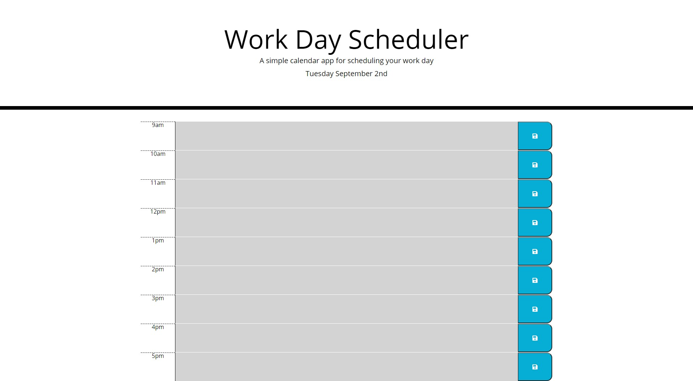

# Day Planner
A functional day planner to help organize all of your tasks through the day.

## Demo

## How to Use
1. Go to the link https://timrob584.github.io/work-day-planner/

2. Depending on the time of day, the boxes will be different colors accordingly:
    For the hours that have past, the boxes will be gray.
    For the current hour, the box will be red.
    For future hours, the boxes will be green.

3. Fill in any tasks you have for the day.

4. Once you have entered your task, hit the save icon to the right of the task to save it to your planner!
